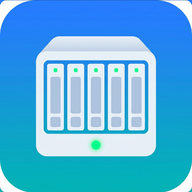
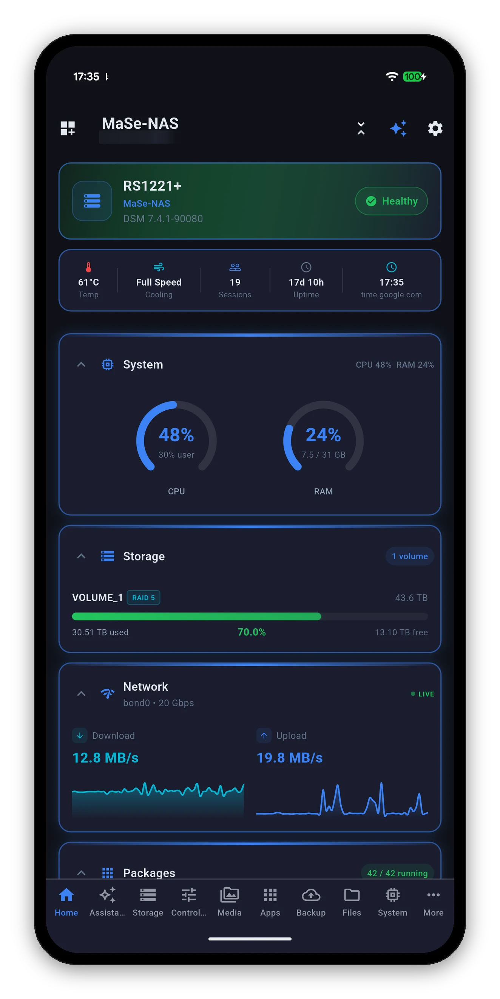
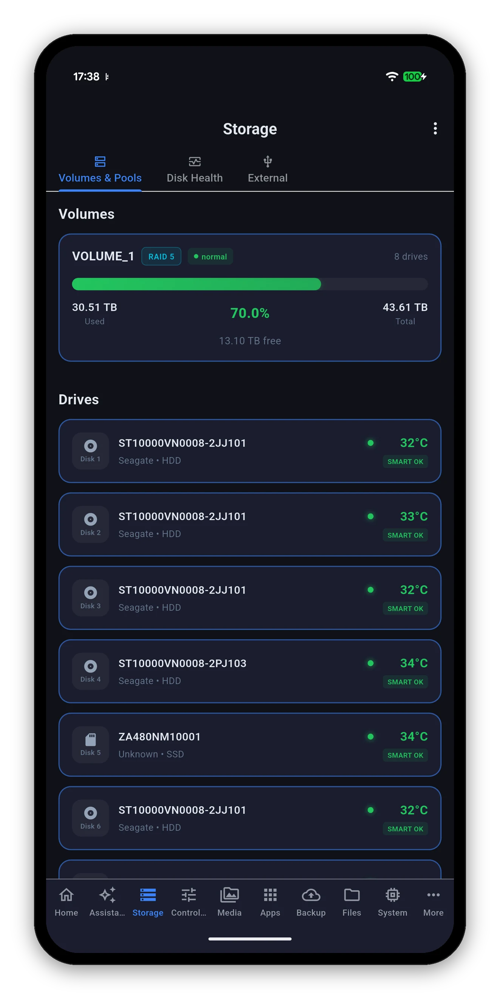
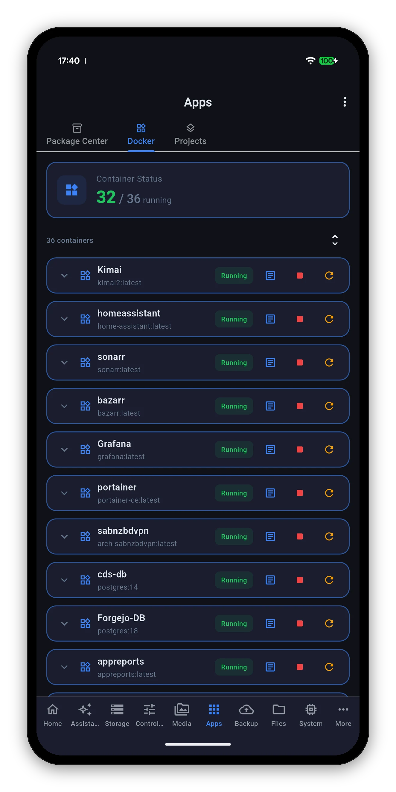

<div align="center">



# Syno Manager

### Your Synology NAS, on every screen

[](https://play.google.com/store/apps/details?id=com.synomanager)
[](https://apps.apple.com/us/app/syno-manager/id6763011668)
[](https://apps.apple.com/us/app/syno-manager/id6763011668)
[](https://apps.microsoft.com/detail/9P19N2B54N1R)

[](https://discord.gg/UmVtxE5fXN)
[](https://synomanager.com)

<br/>

## &#128214; [**Read the full visual manual &rarr;**](https://synomanager.com/guide/)

<br/>

&nbsp;&nbsp;&nbsp;&nbsp;

</div>

---

Syno Manager is a native Synology NAS app for Android, iOS, macOS and Windows. It speaks DSM's own documented APIs - the same ones the web interface calls - and puts the parts of DSM you actually check into one app, without ads, without subscriptions, and without sending your NAS data anywhere.

Add your DiskStation once and the app becomes your console: live system and storage readings, Docker, Package Center, cameras, photos, backups, files, users, scheduled tasks and Wake-on-LAN. Same app on all four stores, and it works the same at home or on the other side of the world.

### What's inside

- **Live monitoring** - CPU, RAM, temperature, load average, disk I/O and per-interface throughput, with a health badge that names the cause rather than just saying "Warning".
- **Storage &amp; drives** - volumes and pools with RAID type and free space, per-drive SMART status and temperature, a Quick SMART Test, and safe eject confirmed by the drive actually leaving.
- **Packages, Docker &amp; VMs** - install, update or uninstall a DSM package; start, stop and restart containers and read their logs; run whole Compose stacks; control virtual machines.
- **Photos, Drive &amp; cameras** - your whole photo library with on-device HEIC decoding, Synology Drive and team folders, and Surveillance Station live view that works from outside without exposing RTSP.
- **Backups** - Hyper Backup tasks with the space they really take at the destination, and Active Backup for Business broken down by workload.
- **Power features** - Download Station, File Station, DDNS, UPS, services, Wake-on-LAN through the NAS, home-screen widgets, a `synomanager://` URL scheme, six accent colours and AMOLED true black.
- **An assistant on your device** - ask about your NAS in plain words, answered by a model running on the device. Offline, read-only, and nothing is transmitted.

&#128073; **The full, illustrated manual lives here:** **https://synomanager.com/guide/**

---

## Report a bug or request a feature

This is the **public bug + feature request repo** for Syno Manager, and it also hosts [synomanager.com](https://synomanager.com). (The app source code lives in a separate, private repository.)

- **[Report a bug](https://github.com/MiyaraHub/synomanager/issues/new?template=bug_report.yml)** - the app crashed, a button doesn't work, something looks wrong.
- **[Request a feature](https://github.com/MiyaraHub/synomanager/issues/new?template=feature_request.yml)** - something the app should do but doesn't.

For general questions, drop into [Discord](https://discord.gg/UmVtxE5fXN), or email [admin@miyarahub.com](mailto:admin@miyarahub.com).

Please don't paste your public IP address, your QuickConnect ID, your DDNS hostname or any password into an issue. A local address like `192.168.1.20` is fine and often useful.

## Supported NAS models

Any Synology NAS running **DSM 7.0 or later** - DiskStation, RackStation and FlashStation, with or without expansion units.

On your side: **Android 7.0+**, **iOS 16.0+**, **macOS 11.0+** or **Windows**.

There is no per-model list to check, because the app doesn't work from one. It asks your NAS what it can do when it connects and shows only the screens it actually supports, so a two-bay DS223j and a rackmount RS1221+ each get a dashboard that matches what they run. The practical test: if DSM's own web interface works from your browser, and your DSM account can see a thing there, Syno Manager can see it too.

DSM 6 is not supported - it uses different API versions and authentication behaviour.

## Support

- **Bugs / features:** [open an issue](https://github.com/MiyaraHub/synomanager/issues/new/choose)
- **Manual:** [synomanager.com/guide](https://synomanager.com/guide/)
- **Troubleshooting:** [synomanager.com/help](https://synomanager.com/help/)
- **Discord:** [discord.gg/UmVtxE5fXN](https://discord.gg/UmVtxE5fXN)
- **Microsoft Store:** [9P19N2B54N1R](https://apps.microsoft.com/detail/9P19N2B54N1R)
- **Email:** [admin@miyarahub.com](mailto:admin@miyarahub.com)

If the app made your NAS easier to live with, leave a review on the Play Store or App Store - it genuinely helps the project keep shipping updates.

---

## The website

`docs/` is the published site, served by GitHub Pages at [synomanager.com](https://synomanager.com).

**Edit `content/`, never `docs/`.** Each file in `content/` is a page body with a small JSON header; `tools/build_site.py` wraps it in the shared navigation, footer, canonical URL, Open Graph tags and structured data, stamps every image with its real dimensions, and writes `docs/`.

```
tools/build_site.py            # rebuild docs/ from content/
tools/build_site.py --check    # fail if docs/ is out of date
tools/build_search_index.py    # rebuild the on-site search index
tools/check_site.py            # links, images, dashes, SEO limits and leaks
```

### Screenshots

Every screenshot on the site is the real app running against a real Synology, not a mock-up. The pipeline is two steps and both are in the repo:

```
tools/capture.sh NAME          # pull a raw capture off a connected device into .raw/
tools/build_screenshots.py     # blur, frame and write docs/screenshots/
```

`build_screenshots.py` holds the manifest, and its `SHOTS` list is where the **privacy pass** is written down: which regions of which capture are destroyed before framing, so a reader can audit what was removed rather than trust that something was. Raw captures live in `.raw/`, which git never sees.

`tools/check_site.py` then greps the built HTML for the specific values the capture device really had - a public IP, a DDNS hostname, real names and addresses - because a blur only protects an image, and the same value can reach a page through prose or a meta description.

---

<div align="center">


**A MiyaraHub Technologies app**

<sub>&copy; MiyaraHub Technologies LLC. All rights reserved. Syno Manager is not affiliated with, endorsed by, or sponsored by Synology Inc. Synology, DSM, DiskStation, RackStation, Hyper Backup, Active Backup, Surveillance Station and QuickConnect are trademarks of Synology Inc.</sub>

</div>
